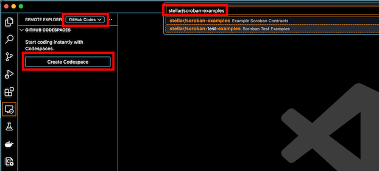

## Running Devcontainers

Building Devcontainers locally.

### Build image locally

Requires:
- [Devcontainer CLI](https://github.com/devcontainers/cli)

Install Devcontainer CLI:
```
npm install -g @devcontainers/cli
```

**Local build script:**
```
devcontainer build \
  --workspace-folder . \
  --config .devcontainer/devcontainer.json
```

### Build and Run Remote Devcontainer on Github Codespaces

Run in browser.

**Launch via Link:**
- <a href="https://github.com/codespaces/new?repo=stellar/soroban-examples">Run on Codespaces</a>
- Click "Open in Codespaces" button in [ ** README️** ](./README.md)

**Launch via Github CLI:**

Requires:
- [Github CLI](https://cli.github.com/)

Install Github CLI:
https://github.com/cli/cli#installation

Create new Codespace:
``` 
# Create a new Codespace
gh codespace create --repo stellar/soroban-examples -b main --status --web -l WestUs2
```

Delete existing Codespaces:
```
# Delete all Codespaces (confirmation auto-approved)
echo 'Y' | gh codespace delete --all --force
```

View Remote Logs or SSH into Codespaces Devcontainer from local:
```
gh codespace ssh
gh codespace logs
```

### Use Remote Devcontainer on Github Codespaces as Local VS Code IDE backend

Run in your local VS Code IDE with Codespaces backend with all of your local settings in place.

- Install [Devcontainers VSCode ext](https://marketplace.visualstudio.com/items?itemName=ms-vscode-remote.remote-containers)
- Install [Codespaces VSCode ext](https://marketplace.visualstudio.com/items?itemName=GitHub.codespaces)
- Open `Remote Explorer` View
- Select `Github Codespaces` from dropdown
- Click `Create Codespace` button
- Enter name of repository `stellar/soroban-examples`



## Devcontainer Build Details

**Base Image:**

- [mcr.microsoft.com/devcontainers/rust](https://hub.docker.com/r/microsoft/devcontainers-rust)
  - Container OS:  Debian

**Features:**

_All of these features are officially listed on https://containers.dev/features_

- [ghcr.io/devcontainers/features/common-utils:2](https://github.com/devcontainers/features/tree/main/src/common-utils)
  - Installs CLI utils for zsh
  - Sets non-root user and UID
  - Upgrades packages

- [ghcr.io/devcontainers/features/rust:1](https://github.com/devcontainers/features/tree/main/src/rust)
  - Sets rustup install profile
  - Sets rust targets
  - Adds VSCode extensions for Rust dev
  - Update containerEnv for: `CARGO_HOME`, `RUSTUP_HOME` and adds Cargo to `PATH`
  - Adds `SYS_PTRACE` Capability which enables `LLDB` debugging in Linux
  - Adds `seccomp=unconfined` during the build process to allow full range of system calls

**ENV Vars:**
- `ENV CARGO_INCREMENTAL=0`
  - Force disabling of incremental compilation
  - Rationale:
    - Dependencies unchanged: Layer cache hit (No need for incremental compilation)
    - Dependencies changed: Layer cache miss and complete rebuild (No use for incremental compilation)
    - Incremental compilation in Devcontainers generates extra artifacts that make caching layers bigger 
      with no benefit
- `ENV DEBIAN_FRONTEND=noninteractive`
  - Accepts the default answer for all questions for apt-get installs
- `PKG_CONFIG_PATH='/usr/lib/pkgconfig:/usr/local/lib/pkgconfig:/usr/share/pkgconfig'`
  - Specifies additional paths in which pkg-config will search for its .pc files
- `CARGO_REGISTRIES_CRATES_IO_PROTOCOL=sparse`
  - Protocol which uses HTTPS to download only necessary crates

## Multi-Layer Caching Strategy

These caching layers are powered by Docker [BuildKit](https://docs.docker.com/build/buildkit/).

**Cache Layer 1**

Build Kit inline cache.  Enabled by a simple env var:  `BUILDKIT_INLINE_CACHE=1`

Inline cache embeds cache metadata into the image config.

[Inline Embedded Cache](https://github.com/moby/buildkit?tab=readme-ov-file#inline-push-image-and-cache-together)

**Cache Layer 2**

[Local file caching](https://docs.docker.com/build/cache/backends/local/).  The local cache store is simple and
relatively effectively and can be used with other caching layers.

Info on [OCI image layout](https://docs.docker.com/build/exporters/oci-docker/).

Example data cache:
```json
{
  "mediaType": "application/vnd.oci.image.manifest.v1+json",
  "config": {
    "mediaType": "application/vnd.buildkit.cacheconfig.v0",
    "digest": "sha256:0c14d3e9278b63f9d4ce9ac93a01037db185bba8ab7765bb1921c70a92b0cdea",
    "size": 5007
  },
  "layers": [
    {
      "mediaType": "application/vnd.oci.image.layer.v1.tar+gzip",
      "digest": "sha256:0289a1845fafa2e548c7bfc34e2dfcc10ac9b80d7f31620de9b37125572c7c08",
      "size": 233
    }
  ]
}
```

**Cache Layer 3**

Images with embedded caching and metadata to registries such as OCI artifacts and manifests.

[Registry Cache](https://docs.docker.com/build/exporters/image-registry/)

**Cache Layer 4**

Github Prebuilds.  Github prebuild are definitely the most effective caching layer and greatly
speed up Github Codespaces.

```text
# Generate manifest
/.codespaces/agent/bin/codespaces prebuild manifest --config-id $CONFIGURATION_ID --image-version Raw
```

Other caching options:
- AWS S3 buckets
- Github Action caches

Ultimately though, we just want the end-user developer to have a good experience and for the coding environment to 
load up quickly and be responsive.

## Devcontainer GH Actions

`validate-devcontainer-json.yml`: Validates Devcontainer JSON Schema

`build-and-test-devcontainer.yml` Validates bash scripts and builds devcontainer with CLI

**Run GH Actions Locally to test build**

Requires:

- [act - Locall GH Action runner](https://github.com/nektos/act)
- [Github CLI](https://cli.github.com/)

Install act:

```
brew install act
```

Setup act:

```
gh act -W '.github/workflows/'
```

List and run GH Workflows

```
gh act --list
gh act --job shellcheck-and-test
```

## Learn about Devcontainers

- [Devcontainers Briefing](https://github.com/anataliocs/comprehensive-devcontainer/blob/main/briefing.md)
- [Devcontainers Properties Reference](https://github.com/anataliocs/comprehensive-devcontainer/blob/main/README.md)
- [Devcontainers devcontainer.json Reference](https://containers.dev/implementors/json_reference/)
- [Available Features](https://containers.dev/features)
