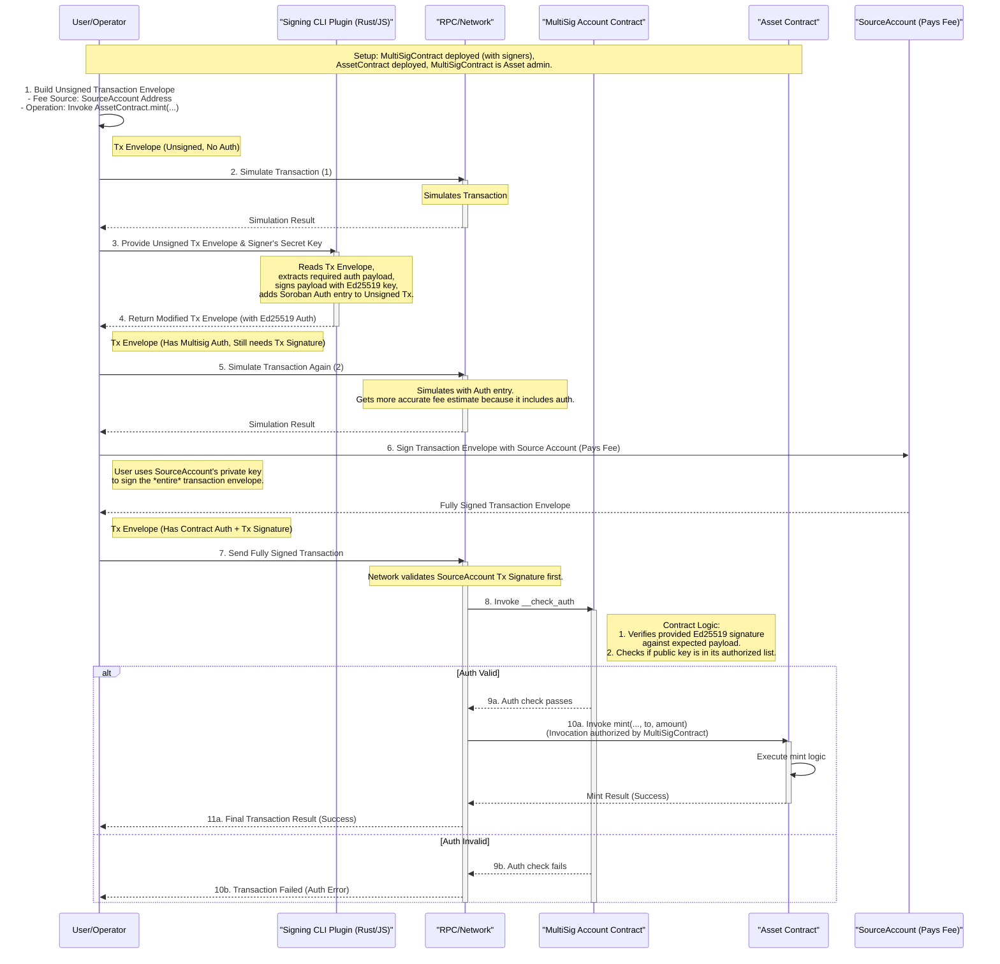

# Multisig 1-of-n Contract Account

This example contains a custom contract account that authorizes when one ed25519
signature is provided, where the signature was produced by a ed25519 key
configured in the contract. The contract may hold any number of keys, and any
key may authorize for it.

The example also contains a stellar-cli plugin that signs authorizations using
an ed25519.

## Sequence Diagram

The following diagram illustrates the flow of how a 1-of-n multisig account
works in this example:



## Usage

The example below sets up an asset with the contract account as the admin. The
admin authorizes with ed25519 keys.

The ed25519 keys used in the example below are:

- Secret Key:
  `0000000000000000000000000000000000000000000000000000000000000000`\
  Public Key: `3b6a27bcceb6a42d62a3a8d02a6f0d73653215771de243a63ac048a18b59da29`
- Secret Key:
  `0000000000000000000000000000000000000000000000000000000000000001`\
  Public Key: `4cb5abf6ad79fbf5abbccafcc269d85cd2651ed4b885b5869f241aedf0a5ba29`

These keys are publicly viewable and not random. Do not use these keys for any
purpose. Select your own keys and update them in the commands below when
executing.

### Install the `stellar sign-auth-ed25519` plugin

Install one of the stellar sign-auth-ed25519 plugin implementations.

#### Rust

```
cd stellar-cli-sign-auth-ed25519
cargo install --locked --path .
```

#### JavaScript (Deno)

```
cd stellar-cli-sign-auth-ed25519-js
deno install \
    --global \
    --name stellar-sign-auth-ed25519 \
    --config deno.json \
    --allow-read \
    --force \
    main.ts
```

Note: By default Deno scripts when installed have no permissions and cannot read
or files, read environment variables, access the network, cannot execute
commands. The `--allow-read` flag is specified to give the script permission to
read files so that it can read .wasm dependencies in the
`@stellar/stellar-xdr-json` package which is a Rust-built-to-wasm npm package.

### Deploy the contract account

```
cd contract
stellar contract build --out-dir out/
stellar contract deploy \
    --alias admin \
    --wasm out/soroban_multisig_1_of_n_account_contract.wasm \
    -- \
    --signers '[
      "3b6a27bcceb6a42d62a3a8d02a6f0d73653215771de243a63ac048a18b59da29",
      "4cb5abf6ad79fbf5abbccafcc269d85cd2651ed4b885b5869f241aedf0a5ba29"
    ]'
```

### Deploy asset

```
stellar keys generate issuer --fund
stellar contract asset deploy \
    --alias asset \
    --asset ABC:issuer
```

### List of contracts

```
stellar contract alias ls
```

### Set admin

```
stellar contract invoke --id asset -- \
    set_admin \
    --new_admin admin
```

### Mint

Call mint, sending to an address. The invocation will be signed by the admin
using one of the ed25519 keys set in the constructor. Choose which key signs by
setting the `--secret-key` option to one of the two keys above.

```
stellar contract invoke --id asset --build-only -- \
    mint \
    --to CAAAAAAAAAAAAAAAAAAAAAAAAAAAAAAAAAAAAAAAAAAAAAAAAAAABSC4 \
    --amount 123 \
  | stellar tx simulate \
  | stellar sign-auth-ed25519 \
      --secret-key 0000000000000000000000000000000000000000000000000000000000000001 \
      --signature-expiration-ledger 2296800 \
  | stellar tx simulate \
  | stellar tx sign --sign-with-key issuer \
  | stellar tx send
```

Note: The issuer is signing the transaction to pay the fee, but the admin
signature produced by the `sign-auth-ed25519` plugin is what is authorizing the
mint. Any account could pay for the fee.

### View Balance

```
stellar contract invoke --id asset -- \
    balance \
    --id CAAAAAAAAAAAAAAAAAAAAAAAAAAAAAAAAAAAAAAAAAAAAAAAAAAABSC4
```
